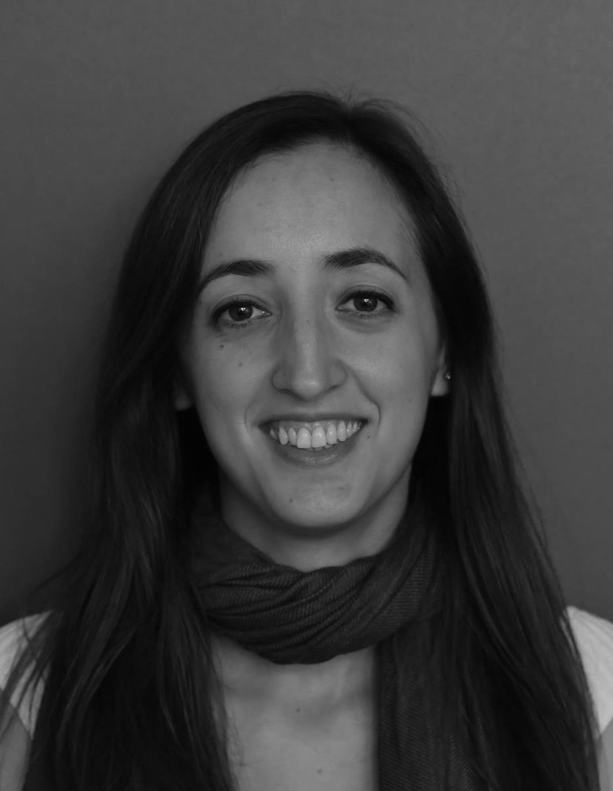

---
# You don't need to edit this file, it's empty on purpose.
# Edit theme's home layout instead if you wanna make some changes
# See: https://jekyllrb.com/docs/themes/#overriding-theme-defaults

layout: default
---

I am currenly a PhD student (and ATER) in the Crypto team at the Laboratory of Mathematics of Versailles (UVSQ). I did a B.S. in Mathematics at University of Cagliari, Italy (2012) and a M.S. in Cryptology at University Joseph Fourier of Grenoble (2014). I started my PhD in 2015, under the supervision of Louis Goubin and Nicolas Gama. I study **Fully Homomorphic Encryption** and **Cloud Computing**. 

* * *

# Contact

Bâtiment Descartes, bureau 306 A

45, avenue des États Unis

78035 Versailles cedex

**E-mail:** ilaria.chillotti@uvsq.fr

* * *

# Publications

#### 2017

*   **Faster Packed Homomorphic Operations and Efficient Circuit Bootstrapping for TFHE** I. Chillotti, N. Gama, M. Georgieva, and M. Izabachène. _ASIACRYPT 2017_. [ePrint](http://eprint.iacr.org/2017/430)

#### 2016

*   **Attacking FHE-based applications by software fault injections.** I. Chillotti, N. Gama, and L. Goubin. _IACR Cryptology ePrint Archive 2016_. [ePrint](http://eprint.iacr.org/2016/1164)
*   **Faster fully homomorphic encryption: Bootstrapping in less than 0.1 seconds.** I. Chillotti, N. Gama, M. Georgieva, and M. Izabachène. _ASIACRYPT 2016_ (Best Paper). [ePrint](http://eprint.iacr.org/2016/870).  
*   **A homomorphic lwe based e-voting scheme.** I. Chillotti, N. Gama, M. Georgieva, and M. Izabachène. _PQCrypto 2016_.

* * *

# Developpement

*   **TFHE: Fast Fully Homomorphic Encryption over the Torus.** A fast open-source library for fully homomorphic encryption. [GitHub](https://tfhe.github.io/tfhe/)

* * *

# Talks

*   October 2017 - **Faster Packed Homomorphic Operations and Efficient Circuit Bootstrapping for TFHE.** At Lattice and crypto meetings (ENS Lyon, France).

*   September 2017 - **Le chiffrement homomorphe.** At Journée du LMV (University of Versailles, France).

*   April 2017 - **Faster fully homomorphic encryption: Bootstrapping in less than 0.1 seconds.** At Journées Codage et Cryptographie 2017 (France).

*   April 2017 - **Faster fully homomorphic encryption: Bootstrapping in less than 0.1 seconds.** At Séminaire GTBAC (Télécom ParisTech, France).

*   February 2017 - **Faster fully homomorphic encryption: Bootstrapping in less than 0.1 seconds.** At Séminaire de cryptographie (ENS Paris, France).

*   January 2017 - **Faster fully homomorphic encryption: Bootstrapping in less than 0.1 seconds.** At Séminaire de cryptographie (University of Caen, France).

*   November 2016 - **Faster fully homomorphic encryption: Bootstrapping in less than 0.1 seconds.** At Lattice and crypto meetings (ENS Lyon, France).

*   November 2016 - **Faster fully homomorphic encryption: Bootstrapping in less than 0.1 seconds.** At Séminaires CRYPTO (University of Versailles, France).

*   April 2016 - **An Homomorphic LWE based E-voting Scheme.** At Séminaires CRYPTO (University of Versailles, France).

*   February 2016 - **An Homomorphic LWE based E-voting Scheme.** At PQCrypto 2016 (Japan).

*  	December 2015 - **Fully Homomorphic Encryption.** At Seminari di Matematica (University of Cagliari, Italy).

*  	December 2015 - **Fully Homomorphic Encryption.** At Séminaires des jeunes LMV (University of Versailles, France).

*   October 2015 - **Attaques par Safe-Errors dans le Cloud.** At Journées Codage et Cryptographie 2015 (France).

* * *

# Schools

*   **Fully homomorphic encryption.** At CryptoBG International Summer School 2016 (Bulgaria).

*   **La Cryptographie.** At Ateliers BD Sciences (Exploradôme Vitry-sur-Seine, France) - 25-26 April 2016.

*   **Implementing a Fully Homomorphic Encryption scheme.** At CryptoBG International Summer School 2015 (Bulgaria).

* * *

# Teaching

#### University of Versailles

*   **Cryptographie**: TD 30h - M1 Mathematics (2017) and M1 Informatics (2015, 2016).
*   **TER**: 2 students M1 Informatics (2016).
*   **Compléments de maths discrètes**: TD 15h - M1 Informatics (2015, 2016, 2017).
*   **Cryptographie**: TD 36h - L3 Informatics (scheduled for 2018).
*   **Maths pour l'info**: TD 36h - L2 Informatics (2017).
*   **Fondaments de l'informatique II**: TD 36h - L1 Informatics (scheduled for 2018).
*   **Fondaments de l'informatique I**: TD 36h - L1 Informatics (2017).

* * *

This site has been made by using the [Jekyll](https://jekyllrb.com/) theme [Slate](https://github.com/pages-themes/slate). 

