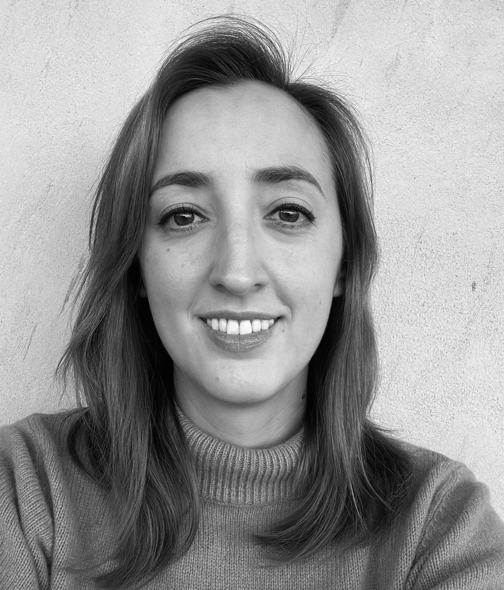

---
# You don't need to edit this file, it's empty on purpose.
# Edit theme's home layout instead if you wanna make some changes
# See: https://jekyllrb.com/docs/themes/#overriding-theme-defaults

layout: default
---

| [**Publications**](./publications.html)  | [**Open-source projects**](./open-source_development.md) | [**Blogposts**](./blogposts.md) | [**Vulgarization**](vulgarization.md) |
| [**Awards**](./awards.md) | [**Talks, Panels & Schools**](./talks_panels_schools.md)  | [**Committees**](./committees.md)  | [**Teaching**](./teaching.md) |

My main research subjects are **Fully Homomorphic Encryption**, **Multi-Party Computation** and **Cloud Computing**. 
I am currently working as researcher at **DESILO Inc**.   

I did a B.S. in Mathematics at University of Cagliari, Italy (2012) and a M.S. in Cryptology at University Joseph Fourier of Grenoble, France (2014). 
From 2015 to 2018 I was a PhD student in the Crypto team at the Laboratory of Mathematics of Versailles (Université Paris-Saclay), under the supervision of Louis Goubin and Nicolas Gama. I defended the PhD thesis _Towards efficient and secure Fully Homomorphic Encryption and cloud computing_ in May 2018. I've been also:
*	An ATER (research and teaching) at University of Versailles (UVSQ, Versailles, France) during the 2017-2018 accademic year.
*	A research intern in the Cryptography Research group at Microsoft Research (Redmond, WA, USA) during Summer 2018.
*	A visiting scientist for the [Lattices: Algorithms, Complexity, and Cryptography](https://simons.berkeley.edu/programs/lattices2020){:target="_blank"} program at Simons Institute (Berkeley, CA, USA) in January-February 2020.
* 	A Post-Doc in the COSIC research group in KU Leuven (Leuven, Belgium) from November 2018 and April 2020.
* 	**Cryptography Research Director** at Zama until November 2023.

* * *

# Contact

[//]: <> (ESAT - COSIC, Computer Security and Industrial Cryptography  )
[//]: <> (Kasteelpark Arenberg 10 - box 2452  )
[//]: <> (3001 Leuven, Belgium  )
[//]: <> (**Office:** B01.26  )

**E-mail:** 
ilaria (dot) chillotti (at) desilo (dot) ai  
**LinkedIn:** 
[Ilaria Chillotti](https://www.linkedin.com/in/ilaria-chillotti-a5703320a/){:target="_blank"}  
**GitHub:** 
https://github.com/ilachill, https://github.com/ilaria-zama  
**ORCID:** 
https://orcid.org/0000-0002-0319-4707  

* * *

This site has been made by using the [Jekyll](https://jekyllrb.com/){:target="_blank"} theme [Slate](https://github.com/pages-themes/slate){:target="_blank"}. 

