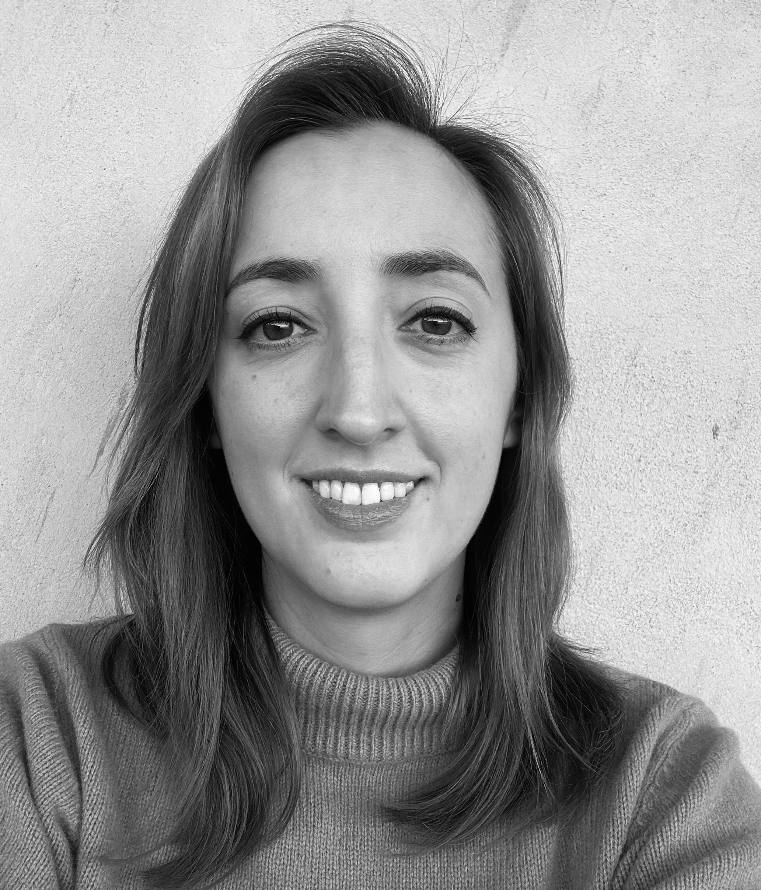

---
# You don't need to edit this file, it's empty on purpose.
# Edit theme's home layout instead if you wanna make some changes
# See: https://jekyllrb.com/docs/themes/#overriding-theme-defaults

layout: default
---

I am a cryptography researcher specializing in **Fully Homomorphic Encryption** (FHE — a technology enabling computation directly on encrypted data).
More broadly, my research interests span Privacy-Enhancing Technologies (PETs) such as Multi-Party Computation (MPC), with applications to secure Cloud Computing.
I currently work as a researcher at **DESILO Inc**.
I am also an active contributor to the ISO SC27/WG2 working group on FHE standardization.

I hold a B.S. in Mathematics from the University of Cagliari, Italy (2012) and an M.S. in Cryptology from the University Joseph Fourier of Grenoble, France (2014).
From 2015 to 2018, I was a PhD student in the Crypto team at the Laboratory of Mathematics of Versailles (Université Paris-Saclay), under the supervision of Louis Goubin and Nicolas Gama, defending a thesis on the efficiency and security of FHE systems (*[Towards Efficient and Secure Fully Homomorphic Encryption and Cloud Computing](/papers/these_Ilaria_Chillotti_wo_acknowl.pdf){:target="_blank"}*), in May 2018.

Before joining DESILO, I held a series of research and industry positions:

- **Research and teaching fellowship (ATER)** at the University of Versailles (UVSQ, France), 2017–2018.
- **Research Intern** in the Cryptography Research group at Microsoft Research (Redmond, WA, USA), Summer 2018.
- **Post-Doc** in the COSIC research group at KU Leuven (Belgium), November 2018 – April 2020.
- **Visiting Scientist** for the [Lattices: Algorithms, Complexity, and Cryptography](https://simons.berkeley.edu/programs/lattices2020){:target="_blank"} program at the Simons Institute (Berkeley, CA, USA), January–February 2020.
- **Cryptography Research Director** at Zama, until November 2023.

* * *

# Contact

[//]: <> (ESAT - COSIC, Computer Security and Industrial Cryptography  )
[//]: <> (Kasteelpark Arenberg 10 - box 2452  )
[//]: <> (3001 Leuven, Belgium  )
[//]: <> (**Office:** B01.26  )

**E-mail:** 
ilaria (dot) chillotti (at) desilo (dot) ai  
**LinkedIn:** 
[Ilaria Chillotti](https://www.linkedin.com/in/ilaria-chillotti-a5703320a/){:target="_blank"}  
**GitHub:** 
https://github.com/ilachill, https://github.com/ilaria-zama  
**ORCID:** 
https://orcid.org/0000-0002-0319-4707  

* * *

This site has been made by using [Jekyll](https://jekyllrb.com/){:target="_blank"}, hosted on [GitHub Pages](https://pages.github.com){:target="_blank"}. 

